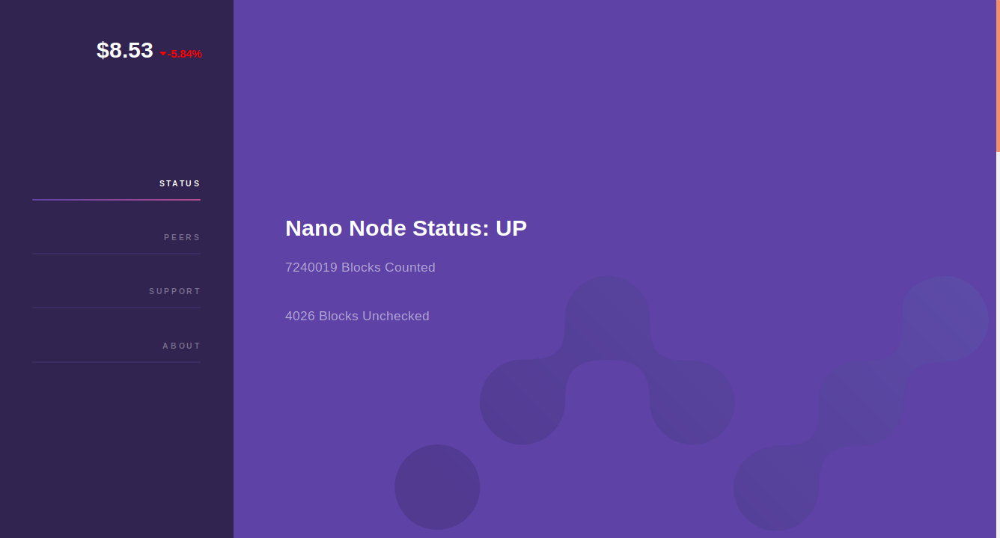

### Nano Node Web Front

A basic frontend to see blocks, peers, current NANO value, and server time per NANO donation. This communicates to a NANO node via RPC, so make sure it is enabled. Rename config.js.example to config.js, then change the js variables to your needs for node address, server cost, and donation account.

Contributions Welcome!

